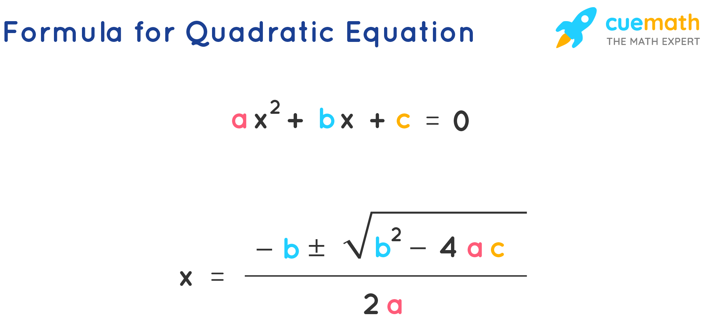

  
# جلسه دوم مبانی برنامه نویسی پایتون
  
  
  # تمرین
  1. برنامه‌ای بنویسید که دو مقدار از ورودی خوانده و مقدار بزرگتر را چاپ کند
  2. برنامه‌ای بنویسید که دو عدد از ورودی بخواند و اگر عدد اول زوج بود، جمع آنها و اگر عدد اول فرد بود، ضرب آن دو عدد چاپ شود.
  3. سه عدد از ورودی بگیرید و برمبنای عدد اول تصمیم بگیرید:
  - اگر باقیمانده تقسیم عدد اول بر عدد 3 برابر صفر بود: جمع همه چاپ شود.
  - اگر باقیمانده تقسیم عدد اول بر عدد 3 برابر یک بود: ضرب همه چاپ شود.
  - اگر باقیمانده تقسیم عدد اول بر عدد 3 برابر دو بود: جمع اولی و دومی منهای سومی چاپ شود.
  
  4. برنامه‌ای بنویسید که دو عدد از ورودی بگیرد و جمع اعداد بین آن دو را چاپ کند.
  5. برنامه‌ای بنویسید که دو عدد از ورودی بگیرد و ضرب اعداد بین آن دو را چاپ کند.
  6. برنامه‌ای بنویسید که تعداد N عدد از ورودی خوانده و مجموع آنها را محاسبه و چاپ کند
  7. برنامه‌ای بنویسید که تعداد N عدد صحیح مثبت را خوانده و از بین آنها تعداد اعدادی که بر 5 بخشپذیر هستند را مشخص نماید.
  8. برنامه‌ای بنویسید که یک عدد از ورودی بخواند و مقسوم علیه های آن را چاپ کند(مقسوم علیه، اعداد کوچکتر بخشپذیر بر آن عدد).

## تمرین‌های پیشرفته
1. برنامه‌ای بنویسید که ضرایب معادله درجه دوم را بگیرد و ریشه‌های آن را بدست‌ آورد

2. برنامه‌ای بنویسید که عدد از کاربر ورود ی بگیرد و مشخص کند که حدس کاربر از عدد مورد نظر سیستم (مثلا 100) کوچکتر است یا بزرگتر و این حدس زدن تا وقتی که کاربر آن عدد سیستمی را وارد نکرده ادامه پیدا کند.
example:
  
`input: 1`
  
output: lower
  
`input: 2`
  
output: lower
  
`input: 4`
  
output: upper
  
`input: 3`
  
output: exact !
